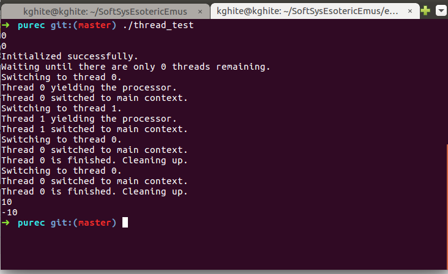
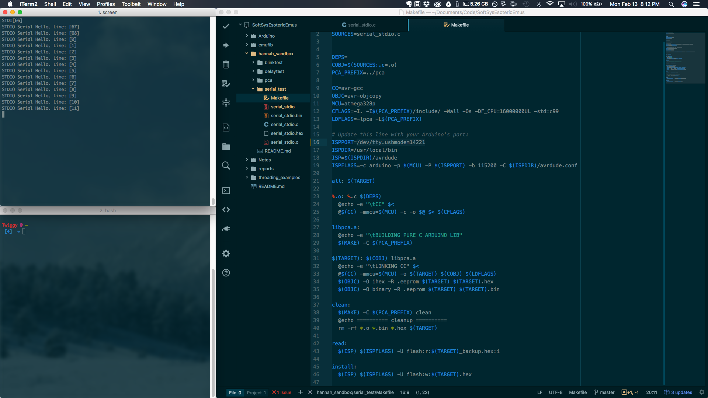

Emufib is a threading library developed to run on an Arduino architecture.  The library provides standard threading capabilities including 

* init() 
* create()
* yield()
* destroy()

This covers all of the basic thread functions found in the [PThread](https://computing.llnl.gov/tutorials/pthreads/) library commonly used in C applications.  Along with the library files, the emufib repository also includes several different threading demos on both Arduino and standard machine architectures.  To install the library and run these demonstrations, follow the instructions provided in the repository README file.

### Background

Multithreading can be applicable in many programming applications and is well represented and documented in the C programming language.  However, because the Arduino does not come loaded with an operating system, standard threading functionality can be difficult to implement.  Though it is common to apply "protothreading" to an Arduino program (using timers to control program flow and transition between operations), the emufib library makes it easy to utilize a multithreading implementation that emulates threading on a normal machine.  By creating stacks for each process within memory and accessing the registers on the atmel microcontroller, emufib mimics multithreading and provides the same performance.  This allows a user to compile pure C onto the Arduino with threading provided.

### Implementation

**Threading Library**

About the C background functions

**Arduino Memory Architecture**

Arudino memory

**Library Structure**

Putting it all together

**Use**

Use cases

**Challenges and Future Work**

Next up

### Results

The pure C version of the library works as expected, switching between threads correctly as indicated in the example.  The pure C library can be used to show that the background threading functionality is correctly implemented before porting to the Arduino architecture.  Basic PThread functionality is included, so the files can also be used as a lightwight threading option for C projects.

To debug the Arduino, it is possible to open up a serial connection using the provided C library as described in the README.  However, this can negatively alter the threading registers and create memory problems, so it is not recommended as a debugging method within threads.

The Arduino test setup allows debugging via LED lights to prevent serial print statements from altering thread registers in the program.  Writing to an LED is fast and simple in assembly, and example write commands can be found in the test files.

The final Arduino test video below shows two LEDs successfully running on parallel threads to blink at different rates.  This 

FINAL VIDEO HERE

### Project Information

**Project Authors**

Hannah Twigg-Smith, Emma Price, Kathryn Hite

**Project License**

This project is licensed using the MIT License.  See the [README](https://github.com/hannahtwiggsmith/SoftSysEsotericEmus/blob/master/README.md) for more details.
